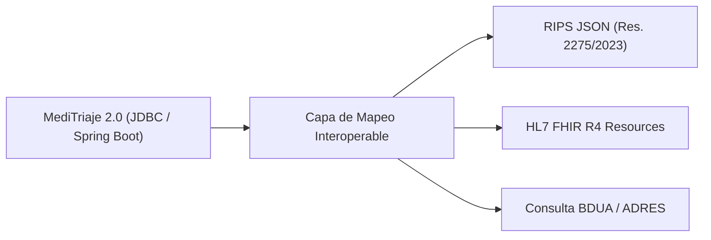

# Arquitectura de Interoperabilidad Hospitalaria — MediTriaje 2.0

> **Contexto:** Valledupar, Cesar, Colombia  
> **Normativa de Referencia:** Resolución 2275 de 2023 (RIPS en formato JSON), Resolución 2337 de 2023 (CUPS), Ley Estatutaria 1751 de 2015, Estándar HL7 FHIR R4  
> **Estado Técnico:** Arquitectura de datos mapeable e interoperable implementada; conectores gubernamentales sujetos a credenciales y convenios institucionales oficiales (ADR-028, O05).

---

## 1. Visión General

MediTriaje 2.0 desacopla sus modelos transaccionales asistenciales de los formatos de intercambio externos, permitiendo transformar atenciones clínicas, urgencias, hospitalizaciones y recetas hacia los estándares del Sistema General de Seguridad Social en Salud (SGSSS) de Colombia.



---

## 2. Especificación RIPS en Formato JSON (Resolución 2275 de 2023)

A partir de la Resolución 2275 de 2023, los prestadores de servicios de salud en Colombia transmiten el Registro Individual de Prestación de Servicios de Salud (RIPS) como soporte de la Factura Electrónica de Venta (FEV) en estructura JSON validada ante el Ministerio de Salud.

### 2.1. Estructura Principal del Archivo JSON

```json
{
  "numDocumentoIdObligado": "900123456",
  "numFactura": "FEV-10023",
  "tipoNota": null,
  "numNota": null,
  "usuarios": [
    {
      "tipoDocumentoIdentificacion": "CC",
      "numDocumentoIdentificacion": "1065123456",
      "tipoUsuario": "01",
      "fechaNacimiento": "1990-05-12",
      "codSexo": "M",
      "codPaisResidencia": "170",
      "codMunicipioResidencia": "20001",
      "codZonaTerritorialResidencia": "01",
      "incapacidad": "NO",
      "codPaisOrigen": "170",
      "servicios": {
        "consultas": [],
        "procedimientos": [],
        "urgencias": [],
        "hospitalizacion": [],
        "medicamentos": [],
        "otrosServicios": []
      }
    }
  ]
}
```

### 2.2. Mapeo de Urgencias y Triaje (`urgencias`)

| Campo RIPS JSON | Origen en MediTriaje 2.0 | Formato / Catálogo |
|---|---|---|
| `codPrestador` | `SEDE.CODIGO_HABILITACION` | REPS 12 dígitos |
| `fechaInicioAtencion` | `EPISODIO_ATENCION.INGRESO_AT` | `YYYY-MM-DD HH:mm` |
| `causaMotivo` | `INGRESO_URGENCIA.MEDIO_LLEGADA` | Catálogo MinSalud (38 Enfermedad general) |
| `codDiagnosticoPrincipal` | `VALORACION_TRIAJE` / `ATENCION_MEDICA` | CIE-10 (4 caracteres) |
| `clasificacionTriaje` | `VALORACION_TRIAJE.NIVEL` | I, II, III, IV, V (Res 5596/2015) |
| `condicionDestino` | `EGRESO_HOSPITALARIO.TIPO_DESTINO` | 01 Alta, 02 Remisión, 03 Hospitalización |

### 2.3. Mapeo de Hospitalización (`hospitalizacion`)

| Campo RIPS JSON | Origen en MediTriaje 2.0 | Formato / Catálogo |
|---|---|---|
| `viaIngresoServicioSalud` | `EPISODIO_ATENCION.TIPO` | 01 Urgencias, 02 Consulta Externa |
| `fechaIngreso` | `EPISODIO_ATENCION.INGRESO_AT` | Timestamp ISO |
| `numAutorizacion` | `AFILIACION_PACIENTE.NUM_AUTORIZACION` | Alfanumérico opcional |
| `fechaEgreso` | `EGRESO_HOSPITALARIO.CREADO_AT` | Timestamp ISO |
| `codDiagnosticoEgreso` | `EGRESO_HOSPITALARIO.DIAGNOSTICO_EGRESO` | CIE-10 |

---

## 3. Catálogos Normalizados de Referencia

1. **CUPS (Resolución 2337 de 2023):**
   - Procedimientos diagnósticos, quirúrgicos y de laboratorio mapeados en `PROCEDIMIENTO_HOSPITALARIO.CODIGO_CUPS` (ej. `890201` Consulta de urgencias, `890701` Triaje médico).
2. **CIE-10 / CIE-11:**
   - Codificación obligatoria para diagnósticos de ingreso, presuntivos, confirmados y de egreso.
3. **CUM (Código Único de Medicamentos - INVIMA):**
   - Identificación de principio activo, concentración y forma farmacéutica en prescripciones médicas y dispensación hospitalaria.
4. **Tipos de Identificación Personal (MinSalud):**
   - `CC`: Cédula de Ciudadanía
   - `TI`: Tarjeta de Identidad
   - `RC`: Registro Civil
   - `CE`: Cédula de Extranjería
   - `PA`: Pasaporte
   - `PE`: Permiso Especial de Permanencia
   - `PPT`: Permiso por Protección Temporal
   - `AS`: Adulto Sin Identificación (manejado vía `IDENTIDAD_PROVISIONAL`)
   - `MS`: Menor Sin Identificación

---

## 4. Consulta y Comprobación de Derechos (BDUA / ADRES)

MediTriaje 2.0 incluye en su Fase A y C el módulo de aseguramiento `AFILIACION_PACIENTE` y `LOTE_IMPORTACION_EPS`:

- **Arquitectura de Contingencia:** Cuando el servicio de consulta web externa de ADRES no esté disponible o el paciente no figure en bases de datos activas, la plataforma aplica el principio de **no bloqueo asistencial**:
  - Se registra el paciente bajo la categoría administrativa `NO_ASEGURADO` / `PARTICULAR`.
  - El triaje y la atención de urgencias proceden de inmediato sin interrupción ni demoras administrativas.
  - La regularización de derechos se realiza post-atención mediante trabajo social o admisiones.

---

## 5. Mapeo a Recursos HL7 FHIR Release 4

| Entidad MediTriaje 2.0 | Recurso HL7 FHIR R4 | Perfil y Mapeo Principal |
|---|---|---|
| `Paciente` | `Patient` | `identifier` (CC/TI/PPT), `name`, `birthDate`, `telecom` |
| `IdentidadProvisional` | `Patient` | `extension:temporaryIdentifier`, `gender`, `identifier:NN` |
| `Profesional` | `Practitioner` | `identifier:registroMedico`, `qualification:especialidad` |
| `EpisodioAtencion` | `Encounter` | `status`, `class:emergency/inpatient`, `period.start/end` |
| `ValoracionTriaje` | `Observation` | `code:triageCategory`, `valueCodeableConcept:I..V`, vital signs |
| `CamaHospitalaria` | `Location` | `status`, `physicalType:bed`, `partOf:Room` |
| `OcupacionCama` | `Encounter.location` | `location`, `status:active/completed`, `period` |
| `ProcedimientoHospitalario` | `Procedure` | `code:CUPS`, `status`, `performedPeriod` |
| `RecetaMedica` | `MedicationRequest` | `intent:order`, `dosageInstruction`, `medicationCodeableConcept` |
| `Dispensacion` | `MedicationDispense`| `status:completed`, `whenHandedOver`, `quantity` |

---

## 6. Declaración de Alcance y Transparencia

> [!IMPORTANT]
> MediTriaje 2.0 implementa toda la estructura de persistencia relacional, auditoría y modelos DTO necesarios para exportar a RIPS JSON (Res. 2275) y FHIR R4.
> No obstante, los servicios de transmisión en tiempo real hacia servidores del Ministerio de Salud o ADRES requieren certificados digitales institucionales (Token PKI), canal VPN dedicado y convenios formales de interoperabilidad entre la IPS y el Estado, los cuales exceden el marco de este entorno académico y se habilitarán en la etapa de despliegue institucional definitivo.
