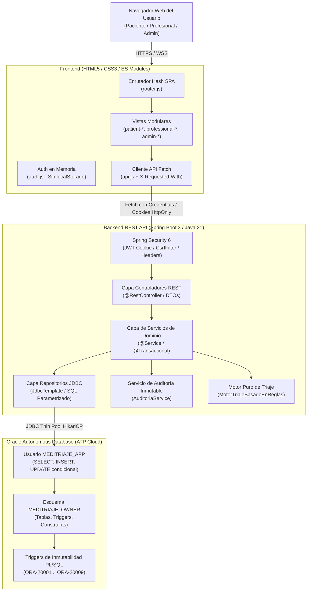

# ARCHITECTURE.md — Arquitectura del Sistema MediTriaje 2.0

> **Versión:** 1.0 (MVP Final)  
> **Fecha:** 2026-10-03  
> **Alcance:** Arquitectura integral de software, seguridad, datos y frontend de MediTriaje 2.0.

---

## 1. Visión y Propósito del Sistema

**MediTriaje 2.0** es una plataforma web para la orientación médica preliminar, triaje clínico estructurado, agendamiento de citas, atención médica inmutable y prescripción farmacológica auditada en el contexto del sistema de salud colombiano.

El sistema fue concebido bajo el principio de **Security by Design** y **Clean Architecture**, asegurando que:
1. Ninguna decisión clínica sea automatizada: el triaje clasifica urgencia y orienta rutas asistenciales, pero nunca emite diagnósticos ni receta medicamentos de forma autónoma (ADR-009).
2. Los registros clínicos cerrados son formalmente **inmutables** tanto a nivel de API como en el motor de base de datos Oracle ATP (ADR-008).
3. La segregación de responsabilidades es absoluta: el personal administrativo gestiona la oferta y la infraestructura, pero tiene **estrictamente vedado el acceso al contenido clínico** (ADR-007).
4. El paciente mantiene el control soberano sobre su consentimiento informado bajo la Ley 1581 de 2012 de Colombia.

---

## 2. Diagrama de Arquitectura de Alto Nivel (C4 Container)



---

## 3. Principios Rectores y Decisiones de Arquitectura (ADRs)

| ADR | Decisión Arquitectónica Clave | Justificación y Aplicación |
|---|---|---|
| **ADR-001** | Stack Java 21 LTS + Spring Boot 3 + Maven | Rendimiento tipado, compatibilidad empresarial y soporte moderno de Virtual Threads y Records inmutables. |
| **ADR-002** | Autenticación con Cookies HttpOnly y JWT | Cero exposición de tokens en `localStorage` (inmune a robo por XSS). Tokens de acceso de vida corta (15 min) y Refresh Tokens opacos rotativos en BD. |
| **ADR-003** | Separación DTO vs. Entidad y ocultamiento de IDs | Cero exposición de claves numéricas autonuméricas (`ID`). La API expone exclusivamente UUIDs v4 públicos (`publicId`). |
| **ADR-004** | Migraciones de base de datos estrictamente con Flyway | Esquemas versionados, reproducibles e inmutables (`V###__*.sql`). Ningún cambio manual en BD. |
| **ADR-005** | Zona horaria obligatoria `America/Bogota` | Todos los cálculos de turnos, disponibilidades y auditorías operan en UTC-5 con `TIMESTAMP WITH TIME ZONE`. |
| **ADR-006** | Disponibilidad atómica y control de colisiones | Prevención de doble reserva mediante transacciones atómicas (`UPDATE ... WHERE ESTADO = 'LIBRE'`) y control de concurrencia 409 Conflict. |
| **ADR-007** | Aislamiento de datos clínicos y relación asistencial | Administradores bloqueados con `403 Forbidden` ante datos clínicos. Médicos requieren relación asistencial activa o ser autores del acto. |
| **ADR-008** | Inmutabilidad de registros clínicos y enmiendas | Atenciones y recetas cerradas no aceptan `UPDATE` ni `DELETE`. Correcciones clínicas vía enmiendas sucesivas anexadas (*append-only*). |
| **ADR-009** | Motor de triaje puramente determinista | Mismas entradas producen idéntico nivel de prioridad (I a V). Corte de emergencia infalible ante síntomas de alarma hacia línea de emergencias 123. |
| **ADR-010** | Catálogo CIE-10 estándar y snapshot farmacológico | Estandarización de diagnósticos con CIE-10 y recetas con copias históricas congeladas de nombre y presentación. |
| **ADR-011** | Auditoría inmutable sin datos clínicos | Trazabilidad completa (quién, cuándo, recurso, acción, IP) sin registrar diagnósticos, fármacos ni síntomas en bitácoras. |
| **ADR-012** | Segregación de usuarios Oracle (OWNER vs. APP) | `MEDITRIAJE_OWNER` administra el DDL vía Flyway; `MEDITRIAJE_APP` opera con privilegios mínimos en runtime, sin `DELETE` clínico. |
| **ADR-013** | Frontend Vanilla (HTML5/CSS3/ES Modules) | Cero complejidad de empaquetado (*no build tools*), carga inmediata, tokens de diseño WCAG AA y máxima mantenibilidad. |

---

## 4. Arquitectura de Backend por Capas

El backend se estructura bajo una separación limpia de responsabilidades dentro del paquete `com.meditriaje`:

```text
com.meditriaje/
├── config/              # Configuración de Seguridad, CORS, HikariCP, Clock
├── controller/          # Endpoints REST expuestos a clientes autorizados
│   └── admin/           # Controladores de infraestructura y oferta asistencial
├── dto/                 # Contratos inmutables de API (Java Records con validaciones Bean Validation)
│   ├── admin/           # Solicitudes y respuestas administrativas
│   ├── appointment/     # Agendamiento, citas y agenda médica
│   ├── attention/       # Registro clínico, signos vitales y enmiendas
│   ├── auth/            # Credenciales, registro y sesiones
│   ├── availability/    # Búsqueda de turnos libres
│   ├── common/          # ApiError, PaginatedResponse
│   ├── prescription/    # Prescripción farmacológica y catálogos
│   └── triage/          # Evaluación y resultados de triaje
├── exception/           # Jerarquía de excepciones de dominio mapeadas en GlobalExceptionHandler
├── model/               # Modelos de dominio inmutables (Java Records) y máquinas de estado
├── repository/          # Acceso a datos con JdbcTemplate y SQL 100% parametrizado
├── security/            # Filtros JWT y CSRF, JwtService, TokenHashUtil, EntryPoints
├── service/             # Lógica de negocio, orquestación transaccional y validaciones
└── triage/              # Motor puro de reglas de triaje determinista
```

### Características de la Implementación:
1. **Modelos Inmutables:** El dominio utiliza Java `record` en su totalidad, garantizando inmutabilidad en memoria.
2. **Sin ORM:** No se utiliza Hibernate/JPA. Todo el acceso a datos se realiza con `JdbcTemplate` y sentencias SQL explícitas y parametrizadas, evitando problemas de caché de segundo nivel, consultas N+1 y falta de control sobre bloqueos en Oracle.
3. **Manejo Centralizado de Excepciones:** `GlobalExceptionHandler` intercepta todas las excepciones del dominio (`RecursoNoEncontradoException`, `DatosInvalidosException`, `AccesoNoAutorizadoException`, `CitaNoDisponibleException`) y genera respuestas HTTP uniformes en formato `ApiError`, sin exponer trazas de depuración al cliente.

---

## 5. Arquitectura de Seguridad

La seguridad está implementada en múltiples capas independientes (*Defense in Depth*):

1. **Capa Perimetral / HTTP:**
   - **Content-Security-Policy (CSP):** `default-src 'self'; script-src 'self'; style-src 'self' 'unsafe-inline'; font-src 'self'; img-src 'self' data:; connect-src 'self'; frame-ancestors 'none';`.
   - **Referrer-Policy:** `strict-origin-when-cross-origin`.
   - **Permissions-Policy:** Bloqueo de APIs de navegador sensibles (`camera=(), microphone=(), geolocation=()`).
   - **Anti-Clickjacking:** `X-Frame-Options: DENY`.
2. **Capa de Autenticación y Sesiones:**
   - Cookies `HttpOnly; Secure; SameSite=Strict; Path=/`.
   - Token de acceso JWT con firma HMAC-SHA256 y expiración en 15 minutos.
   - Refresh Token opaco con rotación obligatoria en cada renovación y detección inmediata de reutilización que revoca todas las sesiones activas de la cuenta.
   - Hasheo de contraseñas con **Argon2id** (algoritmo recomendado por OWASP v5.8).
   - Bloqueo temporal de cuenta tras 5 fallos consecutivos durante 15 minutos, con respuesta unificada contra enumeración de usuarios.
3. **Capa de Protección CSRF:**
   - Mitigación dual: Directiva `SameSite=Strict` combinada con el filtro `CsrfHeaderFilter` que valida la presencia de `X-Requested-With: XMLHttpRequest` en todas las peticiones que mutan estado (`POST`, `PUT`, `PATCH`, `DELETE`).
4. **Capa de Base de Datos e Inmutabilidad:**
   - Triggers PL/SQL en Oracle ATP que disparan errores de aplicación (`ORA-20001` a `ORA-20009`) ante cualquier intento de `UPDATE` o `DELETE` sobre registros clínicos cerrados o auditorías.
   - Usuario de conexión de la aplicación (`MEDITRIAJE_APP`) sin privilegios `DELETE` en tablas clínicas.

---

## 6. Arquitectura del Frontend

El frontend está implementado como una Single Page Application (SPA) pura sin compiladores, bundlers ni dependencias externas:

```text
frontend/
├── assets/icons/        # 26 Iconos vectoriales SVG inline estilo Lucide
├── css/
│   ├── base.css         # Reset, layout mobile-first, utilidades y skip-link
│   ├── components.css   # Componentes atómicos (botones, tarjetas, badges, modales, toasts, tablas)
│   └── tokens.css       # Design tokens (colores, espaciado, tipografía, radios, sombras, contraste WCAG AA)
├── js/
│   ├── views/           # Vistas modulares por rol y caso de uso
│   │   ├── admin-views.js         # Panel unificado de administración (5 pestañas)
│   │   ├── auth-views.js          # Formularios de Login y Registro
│   │   ├── patient-booking.js     # Selección de slots y reserva
│   │   ├── patient-dashboard.js   # Panel principal del paciente
│   │   ├── patient-history.js     # Línea de tiempo de historia clínica y recetas
│   │   ├── patient-triage.js      # Asistente de triaje y corte de emergencia
│   │   ├── professional-agenda.js # Agenda diaria del médico
│   │   ├── professional-attention.js # Registro de atención y enmiendas
│   │   └── professional-prescription.js # Emisión de recetas médicas
│   ├── api.js           # Cliente API fetch con credentials: 'include' y CSRF
│   ├── app.js           # Inicialización y control de ciclo de vida
│   ├── auth.js          # Almacén de sesión en memoria
│   ├── router.js        # Enrutador hash con guardias por rol
│   └── ui.js            # Helpers UI (toasts, modales accesibles, skeletons, escape XSS)
├── index.html           # Contenedor raíz SPA
└── styleguide.html      # Catálogo interactivo de componentes y estados
```

---

## 7. Despliegue e Infraestructura Cloud

La solución está preparada para despliegue híbrido desacoplado en la nube:
* **Base de Datos:** Oracle Cloud Infrastructure (OCI) — Autonomous Transaction Processing (ATP Always Free) con cifrado transparente TDE y copias de seguridad continuas.
* **Backend:** Render Web Service ejecutando el artefacto empaquetado Spring Boot (OpenJDK 21) conectado por JDBC Thin con Wallet de autenticación mutua (mTLS) montado en `/etc/secrets/wallet`.
* **Frontend:** Vercel o GitHub Pages sirviendo los activos estáticos HTML/CSS/JS con caché optimizado de borde y conexión segura vía CORS.
