# MediTriaje 2.0 — Modelo Entidad-Relación (MER)

> Especificación del Modelo Entidad-Relación conceptual y lógico para MediTriaje 2.0 (v0.1 MVP).
> Basado en `docs/MVP.md` §4, `docs/DECISIONES.md` (ADR-002, ADR-003, ADR-006, ADR-007, ADR-008, ADR-009, ADR-011, ADR-013) y `docs/requirements/REGLAS_NEGOCIO.md`.

---

## 1. Diagrama Entidad-Relación (Mermaid)

```mermaid
erDiagram
    %% ==========================================
    %% MÓDULO: SEGURIDAD, USUARIOS Y CONSENTIMIENTO
    %% ==========================================
    USUARIO ||--|{ USUARIO_ROL : "posee"
    ROL ||--o{ USUARIO_ROL : "asignado_a"
    USUARIO ||--o{ REFRESH_TOKEN : "mantiene"
    USUARIO ||--o{ CONSENTIMIENTO : "otorga"
    USUARIO ||--o| PACIENTE : "perfil_paciente"
    USUARIO ||--o| PROFESIONAL : "perfil_profesional"

    %% ==========================================
    %% MÓDULO: OFERTA ASISTENCIAL E INSTITUCIONES
    %% ==========================================
    INSTITUCION ||--|{ SEDE : "dispone_de"
    ESPECIALIDAD ||--o{ PROFESIONAL : "califica"
    ESPECIALIDAD ||--o{ DISPONIBILIDAD_SLOT : "categoriza"
    PROFESIONAL ||--o{ DISPONIBILIDAD_SLOT : "atiende_en"
    SEDE ||--o{ DISPONIBILIDAD_SLOT : "aloja"

    %% ==========================================
    %% MÓDULO: CITAS Y DISPONIBILIDAD
    %% ==========================================
    DISPONIBILIDAD_SLOT ||--o| CITA : "reservado_por"
    PACIENTE ||--o{ CITA : "agenda"
    CITA ||--o| CITA : "reprogramada_de"
    TRIAJE ||--o{ CITA : "orienta"

    %% ==========================================
    %% MÓDULO: TRIAJE Y ORIENTACIÓN CLÍNICA
    %% ==========================================
    PACIENTE ||--o{ TRIAJE : "realiza"
    TRIAJE ||--|{ TRIAJE_SINTOMA : "contiene"
    SINTOMA ||--o{ TRIAJE_SINTOMA : "reportado_en"
    SINTOMA ||--o{ REGLA_TRIAJE : "evaluado_por"

    %% ==========================================
    %% MÓDULO: ATENCIÓN CLÍNICA INMUTABLE
    %% ==========================================
    CITA ||--o| ATENCION : "genera"
    PACIENTE ||--o{ ATENCION : "recibe"
    PROFESIONAL ||--o{ ATENCION : "registra"
    DIAGNOSTICO_CIE10 ||--o{ ATENCION : "diagnostica"
    ATENCION ||--o{ SIGNO_VITAL : "registra"
    ATENCION ||--o{ ATENCION_ENMIENDA : "aclarada_por"
    PROFESIONAL ||--o{ ATENCION_ENMIENDA : "emite_enmienda"
    PACIENTE ||--o{ ALERGIA : "reporta"

    %% ==========================================
    %% MÓDULO: RECETAS Y MEDICAMENTOS
    %% ==========================================
    ATENCION ||--o{ RECETA : "prescribe"
    PACIENTE ||--o{ RECETA : "destinada_a"
    PROFESIONAL ||--o{ RECETA : "autorizada_por"
    RECETA ||--|{ RECETA_DETALLE : "incluye"
    MEDICAMENTO ||--o{ RECETA_DETALLE : "referencia_a"

    %% ==========================================
    %% DEFINICIÓN DE ATRIBUTOS CLAVE
    %% ==========================================

    USUARIO {
        number id PK "ID interno identity"
        string public_id UK "UUID expuesto en API"
        string email UK "Correo único"
        string password_hash "Argon2id hash"
        string estado "ACTIVO, INACTIVO, BLOQUEADO"
        number intentos_fallidos "Contador para bloqueo"
        timestamp bloqueado_hasta "Fin de bloqueo temporal"
        timestamp created_at
        timestamp updated_at
    }

    ROL {
        number id PK "ID interno"
        string nombre UK "PACIENTE, PROFESIONAL, ADMIN"
        string descripcion
    }

    USUARIO_ROL {
        number usuario_id FK,PK
        number rol_id FK,PK
    }

    REFRESH_TOKEN {
        number id PK
        number usuario_id FK
        string token_hash UK "Hash SHA-256 del token"
        timestamp expiracion "7 dias de vigencia rotativa"
        number revocado "1=revocado, 0=activo"
        timestamp created_at
    }

    CONSENTIMIENTO {
        number id PK
        number usuario_id FK
        string version_texto "Version de politica Ley 1581"
        number aceptado "1=aceptado forzoso"
        timestamp fecha_aceptacion "Fecha y hora exacta"
        string ip_origen "Trazabilidad legal"
    }

    PACIENTE {
        number id PK "ID interno identity"
        number usuario_id FK,UK "1 a 1 con Usuario"
        string public_id UK "UUID expuesto en API"
        string tipo_documento "CC, TI, RC, CE, PA"
        string numero_documento UK "Documento de identidad"
        string nombres
        string apellidos
        date fecha_nacimiento "Fecha nacimiento"
        string telefono
        timestamp created_at
        timestamp updated_at
    }

    PROFESIONAL {
        number id PK "ID interno identity"
        number usuario_id FK,UK "1 a 1 con Usuario"
        string public_id UK "UUID expuesto en API"
        number especialidad_id FK "Especialidad principal"
        string registro_medico UK "Matricula o tarjeta prof"
        string nombres
        string apellidos
        timestamp created_at
        timestamp updated_at
    }

    ESPECIALIDAD {
        number id PK
        string public_id UK
        string nombre UK "Ej. Medicina General"
        number duracion_slot_min "Duracion defecto (ej. 20 min)"
        string estado "ACTIVO, INACTIVO"
    }

    INSTITUCION {
        number id PK
        string public_id UK
        string nit UK "Identificacion tributaria"
        string razon_social
        string estado "ACTIVO, INACTIVO"
    }

    SEDE {
        number id PK
        number institucion_id FK
        string public_id UK
        string nombre
        string direccion
        string ciudad
        string estado "ACTIVO, INACTIVO"
    }

    DISPONIBILIDAD_SLOT {
        number id PK "ID interno identity"
        string public_id UK "UUID expuesto en API"
        number profesional_id FK
        number sede_id FK
        number especialidad_id FK
        timestamp fecha_hora_inicio "Timestamp with TZ"
        timestamp fecha_hora_fin "Timestamp with TZ"
        string modalidad "PRESENCIAL, TELEMEDICINA"
        string estado "LIBRE, OCUPADO, BLOQUEADO"
    }

    CITA {
        number id PK "ID interno identity"
        string public_id UK "UUID expuesto en API"
        number slot_id FK "Slot asociado"
        number paciente_id FK "Paciente solicitante"
        number triaje_id FK "Triaje previo (opcional)"
        number cita_origen_id FK "Cita previa si es reprogramada"
        string estado "PROGRAMADA, CONFIRMADA, ATENDIDA, CANCELADA, NO_ASISTIO, REPROGRAMADA"
        string motivo_cancelacion "Opcional si se cancela"
        timestamp created_at
        timestamp updated_at
    }

    SINTOMA {
        number id PK
        string public_id UK
        string codigo UK "Identificador mnemónico"
        string nombre
        string categoria
        number es_alarma "1=Activa corte de emergencia"
        string estado "ACTIVO, INACTIVO"
    }

    REGLA_TRIAJE {
        number id PK
        string version "Version de regla prototipo"
        number sintoma_id FK
        string condicion "Regla de duracion/intensidad"
        string nivel_prioridad "I, II, III, IV, V"
        number es_alarma "Bandera de corte inmediato"
        string estado "ACTIVO, INACTIVO"
    }

    TRIAJE {
        number id PK "ID interno identity"
        string public_id UK "UUID expuesto en API"
        number paciente_id FK
        string version_reglas "Version de reglas utilizada"
        string nivel_prioridad "Nivel I a V"
        string ruta_sugerida "Urgencias, Prioritaria, Cita"
        number es_emergencia "1=Corte de emergencia 123"
        string observaciones "Aviso legal de orientacion"
        timestamp created_at
    }

    TRIAJE_SINTOMA {
        number id PK
        number triaje_id FK
        number sintoma_id FK
        number duracion_horas "Duracion de aparicion"
        number intensidad "Escala subjetiva 0 a 10"
    }

    ATENCION {
        number id PK "ID interno identity"
        string public_id UK "UUID expuesto en API"
        number cita_id FK,UK "Relacion 1 a 1 con Cita"
        number paciente_id FK
        number profesional_id FK
        string motivo_consulta
        string evolucion "Nota clinica"
        number diagnostico_cie10_id FK "Diagnostico principal"
        string indicaciones "Plan de manejo"
        string estado "CERRADA (Inmutable)"
        timestamp fecha_cierre
        timestamp created_at
    }

    SIGNO_VITAL {
        number id PK
        number atencion_id FK
        string tension_arterial "Ej. 120/80"
        number frecuencia_cardiaca "Latidos por minuto"
        number frecuencia_respiratoria "Resp por minuto"
        number temperatura "Grados Celsius (ej 36.5)"
        number saturacion_oxigeno "Porcentaje O2"
        number peso_kg
        number talla_cm
    }

    ATENCION_ENMIENDA {
        number id PK "ID interno identity"
        number atencion_id FK "Atencion original inmutable"
        number profesional_id FK "Profesional emisor"
        string motivo "Motivo de la enmienda"
        string contenido "Texto aclaratorio"
        timestamp fecha_enmienda
    }

    DIAGNOSTICO_CIE10 {
        number id PK
        string codigo UK "Codigo CIE-10 (ej J00)"
        string descripcion "Denominacion clinica"
        string estado "ACTIVO, INACTIVO"
    }

    ALERGIA {
        number id PK
        number paciente_id FK
        string sustancia "Farmaco o alergeno"
        string reaccion "Tipo de manifestacion"
        string severidad "LEVE, MODERADA, GRAVE"
        timestamp created_at
    }

    MEDICAMENTO {
        number id PK
        string public_id UK
        string codigo UK "Codigo institucional"
        string nombre_comercial
        string principio_activo
        string presentacion "Ej. Tabletas, Jarabe"
        string concentracion "Ej. 500 mg"
        string estado "ACTIVO, INACTIVO"
    }

    RECETA {
        number id PK "ID interno identity"
        string public_id UK "UUID expuesto en API"
        number atencion_id FK "Atencion generadora"
        number paciente_id FK
        number profesional_id FK
        number vigencia_dias "Dias habiles de vigencia"
        timestamp created_at
    }

    RECETA_DETALLE {
        number id PK
        number receta_id FK
        number medicamento_id FK
        string snapshot_nombre "Copia inmutable del nombre"
        string snapshot_presentacion "Copia inmutable presentacion"
        string dosis "Texto libre indicacion"
        string frecuencia "Frecuencia de toma"
        number duracion_dias
        number cantidad "Unidades totales"
        string indicaciones "Instrucciones de uso"
    }

    AUDITORIA {
        number id PK "ID interno identity"
        number usuario_id "Usuario ejecutor (nullable)"
        string accion "LOGIN, CITA_AGENDAR, etc."
        string tipo_recurso "CITA, ATENCION, RECETA"
        string recurso_public_id "UUID del recurso"
        string resultado "EXITO, FALLO, BLOQUEADO"
        string ip_origen "Direccion IP cliente"
        timestamp fecha_hora "Timestamp with TZ"
    }
```

---

## 2. Descripción Conceptual por Entidad

### 2.1 Seguridad, Acceso y Datos Personales
1. **`USUARIO`**: Representa la cuenta de acceso de cualquier persona al sistema. Almacena credenciales hasheadas con Argon2id, maneja contadores de intentos fallidos para mitigar ataques de fuerza bruta y gestiona estados de bloqueo temporal (ADR-002).
2. **`ROL`**: Catálogo fijo con los tres roles canónicos del sistema (`PACIENTE`, `PROFESIONAL`, `ADMINISTRADOR`).
3. **`USUARIO_ROL`**: Tabla asociativa que implementa la relación muchos a muchos entre usuarios y roles.
4. **`REFRESH_TOKEN`**: Persistencia de tokens de refresco de 7 días, rotativos y revocables, almacenados exclusivamente en formato hash para evitar secuestro de sesiones en caso de brecha (ADR-002).
5. **`CONSENTIMIENTO`**: Registro inmutable de cumplimiento de la Ley 1581 de 2012 (Habeas Data / Datos Sensibles de Salud), capturando la versión exacta de la política aceptada, timestamp e IP de origen (ADR-013).
6. **`AUDITORIA`**: Bitácora centralizada *insert-only*. Registra quién, qué acción, sobre qué recurso público, desde qué IP y cuándo ocurrió un evento, sin almacenar nunca información clínica ni contraseñas (ADR-011).

### 2.2 Estructura Asistencial y Catálogos
7. **`PACIENTE`**: Entidad de negocio que complementa al usuario con datos demográficos, documento de identificación oficial (CC, TI, etc.) y fecha de nacimiento.
8. **`PROFESIONAL`**: Personal de la salud registrado con su número de matrícula médica oficial y su especialidad asignada.
9. **`ESPECIALIDAD`**: Áreas clínicas disponibles (ej. Medicina General, Pediatría) que determinan además la duración por defecto de los slots de atención (ADR-006).
10. **`INSTITUCION`**: Entidad prestadora de salud legalmente constituida.
11. **`SEDE`**: Ubicación física o centro de atención perteneciente a una institución.

### 2.3 Agenda y Reserva Concurrente
12. **`DISPONIBILIDAD_SLOT`**: Turnos de atención pregenerados por la administración para un profesional en una sede y especialidad específica. Estados: `LIBRE`, `OCUPADO`, `BLOQUEADO`.
13. **`CITA`**: Reserva formal de un slot por parte de un paciente. Implementa la máquina de estados estricta (ADR-006) y está protegida en base de datos por un índice funcional único que imposibilita la doble reserva de un slot activo.

### 2.4 Triaje Clínico
14. **`SINTOMA`**: Catálogo base de sintomatologías con indicador booleano `es_alarma` para eventos críticos.
15. **`REGLA_TRIAJE`**: Tabla parametrizada y versionada con los criterios deterministas que mapean síntomas a prioridades I a V (ADR-009).
16. **`TRIAJE`**: Evaluación realizada por un paciente, registrando la prioridad asignada y la versión de reglas utilizada. Si detecta corte de emergencia, desvía al usuario al 123 / urgencias.
17. **`TRIAJE_SINTOMA`**: Detalle N:M de los síntomas seleccionados en un triaje particular con su duración e intensidad reportada.

### 2.5 Atención Médica e Historia Clínica Inmutable
18. **`ATENCION`**: Registro del acto médico. Al pasar a estado `CERRADA`, un trigger a nivel de base de datos prohíbe sentencias `UPDATE` o `DELETE` directas sobre la fila (ADR-008).
19. **`SIGNO_VITAL`**: Parámetros fisiológicos medidos durante la consulta médica (tensión, pulso, temperatura, etc.).
20. **`ATENCION_ENMIENDA`**: Registro *append-only* que permite al profesional corregir o ampliar notas de una atención ya cerrada sin violentar el registro original (ADR-008).
21. **`DIAGNOSTICO_CIE10`**: Catálogo reducido de códigos de clasificación internacional de enfermedades.
22. **`ALERGIA`**: Antecedentes alérgicos relevantes reportados por el paciente.

### 2.6 Farmacia y Prescripción Médica
23. **`MEDICAMENTO`**: Catálogo maestro de fármacos genéricos y comerciales con su presentación y principio activo.
24. **`RECETA`**: Prescripción médica emitida en una transacción indivisible vinculada a la atención.
25. **`RECETA_DETALLE`**: Detalle farmacológico que almacena una **fotografía inmutable (snapshot)** del nombre y presentación del medicamento al momento de recetar, evitando desfasajes si el catálogo maestro cambia en el futuro (HU-08).
